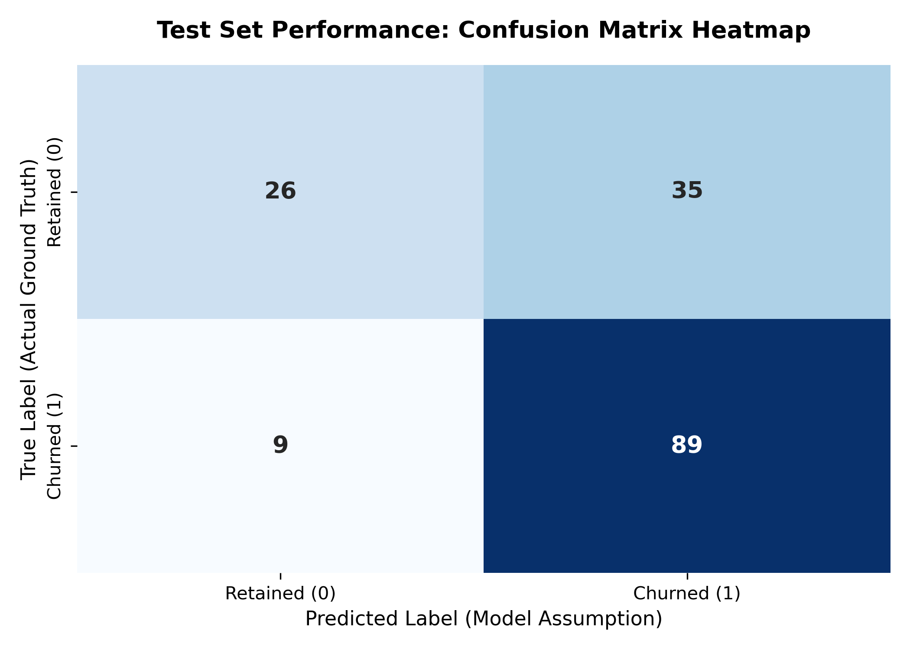
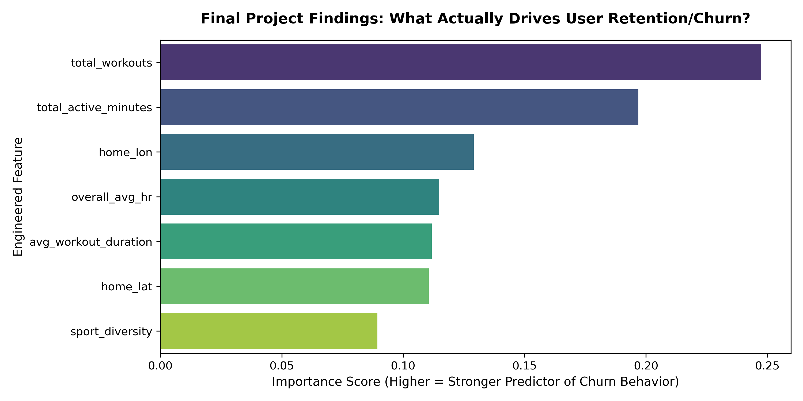

# 🏃‍♂️ Predictive Analytics for User Churn Mitigation in Digital Health Platforms

**Capstone Project - Professional Certificate in Data Analytics** **Imperial College Business School** **Author:** Lilian Gomez

---

## 1. EXECUTIVE SUMMARY
This project addresses user attrition within digital health networks by developing an end-to-end machine learning pipeline using historical workout telemetry from the Endomondo ecosystem. Raw tracking data containing nested sensor logs was audited, cleaned, and aggregated into a static user-habit feature matrix. 

Six distinct predictive architectures were optimized using an isolated validation loop. A Tuned Random Forest Classifier emerged as the champion production model, achieving a final classification Accuracy of **72.0%** and a Churn F1-Score of **80.0%** on a locked, unseen test dataset. This framework allows platforms to proactively flag at-risk accounts and deploy automated retention strategies before users abandon the platform.

---

## 2. INTRODUCTION
In competitive digital health and fitness software markets, customer churn directly undermines recurring subscription revenue and increases Customer Acquisition Costs (CAC). Legacy retention efforts are often reactive, triggering coupons only after an account becomes completely inactive. 

This project aims to convert raw wearable tracking telemetry—such as workout frequencies, duration, and cardiovascular markers—into early behavioral warning indicators. By deploying automated predictive classification, operational teams can dynamically flag accounts experiencing an unannounced decay in workout momentum, shifting the business from a reactive stance to a proactive, automated retention pipeline.

---

## 3. METHODOLOGY

## 3.1 📂 Dataset

The raw data utilized in this project is an engineered subset derived from the public Kaggle repository: [Endomondo Fitness Trajectories](https://www.kaggle.com/datasets/pypiahmad/endomondo-fitness-trajectories). 

The data architecture transitions through a structured, reproducible "Raw-to-Processed" lifecycle across the following directories and notebooks:

| File / Directory | Description |
| :--- | :--- |
| **[Kaggle Source: endomondoHR_proper.json](https://www.kaggle.com/datasets/pypiahmad/endomondo-fitness-trajectories)** | *[Omitted from repo due to GitHub file size limits; download via link]* The original source JSON containing nested high-frequency sensor telemetry (heart rate series, timestamps, and GPS coordinates). |
| `notebooks/1.0_data_cleaning_and_audit.ipynb` | Pipeline auditing, handling missing sensor data, dropping corrupted features. **Transforming raw JSON into structured CSV.** |
| `data/raw/endomondo_summaries.csv` | Initial raw workout logging batch mapped sequentially (generated by Notebook 1.0). |
| `notebooks/2.0_user_feature_engineering.ipynb` | Compressing raw sequential time-series workout logs into static, unique user profiles. |
| `data/processed/endomondo_user_features.csv` | Cleaned, user-level static behavioral matrix containing 1,059 unique user profiles aggregated across 7 distinct habit features (generated by Notebook 2.0). |
| `notebooks/3.0_model_training_and_evaluation.ipynb` | 3-way data partitioning (Train/Validation/Test), hyperparameter grid tuning, and final unbiased performance evaluation. Loads and models the processed features file. |

## 3.2 📐 Target & Metrics Framework

### 🎯 Target Variable Formulation
Because this predictive pipeline is designed to intercept user attrition before it occurs, the operational challenge was framed as a **Binary Classification problem**. 

Following the application of the December 31, 2015 temporal cutoff and the 45-day inactivity rule, the target label $y$ for any unique user $i$ is formulated deterministically as:

$$\text{Target } (y_i) = 
\begin{cases} 
1, & \text{if User is CHURNED (0 workouts logged in the final 45 days)} \\
0, & \text{if User is RETAINED }(\ge 1\text{ workout logged in the final 45 days)}
\end{cases}$$

### 📊 Evaluation Metrics
The underlying user base exhibits a natural class imbalance (~61.7% Churn vs. 38.3% Retained). In imbalanced data structures, optimizing purely for *Accuracy* creates a hazardous "Accuracy Paradox," where a naive model can score highly by simply guessing the majority class while failing to identify actual at-risk users. 

To navigate this, the primary optimization metric chosen for this project is the **Unified F1-Score**, supplemented by secondary checks on Precision, Recall, and Accuracy.

#### 1. F1-Score (Primary Optimization Target)
The F1-Score computes the harmonic mean of Precision and Recall, serving as a single, balanced metric to judge model performance on both classes simultaneously.
$$F_1 = 2 \times \frac{\text{Precision} \times \text{Recall}}{\text{Precision} + \text{Recall}}$$

#### 2. Precision
Quantifies the model's trustworthiness. Out of all athletes flagged by the pipeline as "at risk of churning," what percentage actually abandoned the app? High precision prevents the marketing team from wasting promotional resources on healthy, active users.
$$\text{Precision} = \frac{\text{True Positives (TP)}}{\text{True Positives (TP)} + \text{False Positives (FP)}}$$

#### 3. Recall (Sensitivity)
Quantifies the pipeline's coverage. Out of all actual platform churners, what percentage did the model successfully intercept? High recall is financially vital because missing a churner (**False Negative**) costs significantly more than sending an extra push notification to an active user (**False Positive**).
$$\text{Recall} = \frac{\text{True Positives (TP)}}{\text{True Positives (TP)} + \text{False Negatives (FN)}}$$

#### 4. Classification Accuracy
Measures the overall ratio of correct predictions across both the positive and negative classes out of the entire evaluation pool.
$$\text{Accuracy} = \frac{\text{TP} + \text{TN}}{\text{TP} + \text{TN} + \text{FP} + \text{FN}}$$

*Note: All metric evaluations reported on the leaderboard are derived strictly from cross-validating across the isolated 15% Validation partition, establishing an unbiased comparison baseline before final Test set deployment.*

---

## 4. EXPLORATORY DATA ANALYSIS & PREPROCESSING

1. **Temporal Boundary Selection:** Determined the definitive baseline end-date of the tracking window to be **December 31, 2015**. Analysis of the raw sequence timeline revealed that workouts logged after this threshold were sparse, non-representative statistical outliers. Restricting the boundary to this date preserves target distribution stability.
2. **Dynamic Churn Definition:** Constructed a quantitative, rule-based classification framework to establish ground-truth labels. A user was officially defined as **Churned** ($y=1$) if they registered zero (0) workout activity entries within the **45-day window** preceding the dataset's December 31, 2015 endpoint. Users who maintained logging activity within this final 45-day bracket were categorized as **Retained** ($y=0$).
3. **Exploration & Profiling:** Investigated post-labeling data missingness, feature cardinality, and observed a natural background class distribution consisting of ~61.7% churned profiles vs. 38.3% retained athletes.
4. **Feature Engineering & Handling:**
   * Audited and dropped the `avg_speed` column entirely due to systematic GPS satellite tracking handshaking gaps during indoor training.
   * Applied localized median imputation across continuous biological and temporal attributes to resolve sparsity without shifting underlying feature distributions.
   * Compressed granular, sequential raw workout histories into a unique cross-sectional user matrix consisting of 7 consolidated habit metrics (`total_workouts`, `total_active_minutes`, `avg_workout_duration`, `overall_avg_hr`, `sport_diversity`, `home_lat`, `home_lon`).
5. **Rigorous Data Partitioning:** Enforced a strict **3-Way Stratified Partition Split (70% Train / 15% Validation / 15% Test)**. This establishes an un-breachable data insulation wall between training operations and validation adjustments, completely eliminating data leakage risks.
6. **Baseline Anchor Establishment:** Implemented a structural Baseline Dummy Classifier (predicting the majority class) to benchmark a performance floor.
7. **Algorithmic Evaluation & Hyperparameter Tuning:**
   * Constructed and evaluated a diverse suite of architectures: Logistic Regression, K-Nearest Neighbors (KNN), Support Vector Machines (SVM), Decision Trees, Random Forests, and Gradient Boosted Trees (XGBoost).
   * Executed automated hyperparameter optimization using `GridSearchCV` driven strictly by performance metrics calculated over the isolated validation partition split.
8. **Champion Model Selection:** Crowned the **Tuned Random Forest Classifier** as the optimal operational framework due to its superior capacity to maximize the F1-Score (balancing Precision and Recall seamlessly).
9. **Final Unbiased Exam:** Evaluated the fully configured Random Forest champion model against the locked, untouched Test Set to verify real-world predictive generalization.

---

## 5. TRAINING THE MODELS

### 5.1 Hyperparameter Tuning Configuration
To systematically maximize the out-of-sample Churn F1-Score while fiercely guarding against overfitting, automated hyperparameter optimization was executed using `GridSearchCV`. A 3-fold stratified cross-validation loop (`cv=3`) was applied directly to the training partition, ensuring the validation and test sets remained completely isolated from parameter selection.

The hyperparameter search spaces chosen for each architecture, along with the mathematically optimal configurations discovered by `GridSearchCV`, are detailed below:

#### 1. Dummy Baseline (`DummyClassifier`)
* **Strategy Used:** `most_frequent`
* **Mechanics:** This serves as a non-parametric baseline model. It computes no mathematical optimization boundaries; instead, it blindly predicts the majority class (Churned) for every user record. This anchors the absolute performance floor to prove if the actual machine learning models are extracting genuine predictive patterns.
* **🏆 Selected Best Parameters:** *Non-parametric baseline (No tuning required).*

#### 2. Logistic Regression (`LogisticRegression`)
* **Regularization Strength (`C`):** Evaluated `[0.01, 0.1, 1, 10]`. The parameter $C$ represents the inverse of regularization strength ($C = \frac{1}{\lambda}$). Smaller values impose a brutal penalty on coefficient sizes to prevent over-reliance on any single metric, whereas larger values allow the model to fit more closely to the training points.
* **Optimization Solver (`solver`):** Evaluated `['lbfgs', 'liblinear']`. Different optimization algorithms traverse the log-loss cost function gradient differently. `liblinear` is ideal for smaller datasets, while `lbfgs` handles multi-variable lines with great convergence stability.
* **🏆 Selected Best Parameters:** `{'C': 1, 'solver': 'liblinear'}`
  * *Insight:* A moderate penalty ($C=1$) combined with the coordinate descent approach of `liblinear` yielded the cleanest linear separation boundary without over-scaling feature coefficients.

#### 3. K-Nearest Neighbors (`KNeighborsClassifier`)
* **Neighborhood Volume (`n_neighbors`):** Evaluated `[3, 5, 7, 9, 11]`. This controls the localized geometric voting pool. A lower number creates highly complex, localized boundaries that risk memorizing data noise. A larger number smoothens out decision boundaries by averaging votes across larger behavioral clusters.
* **Distance Weighting (`weights`):** Evaluated `['uniform', 'distance']`. `uniform` treats every neighboring athlete's vote equally. `distance` weights votes inversely to their distance from the query point.
* **🏆 Selected Best Parameters:** `{'n_neighbors': 7, 'weights': 'uniform'}`
  * *Insight:* A neighborhood threshold of $k=7$ successfully optimized the bias-variance trade-off, preventing the model from overreacting to single outlier points, while `uniform` voting indicates that raw cluster density is more predictive than distance proximity.

#### 4. Support Vector Machine (`SVC`)
* **Error Penalty Parameter (`C`):** Evaluated `[0.1, 1, 10]`. This acts as a soft-margin penalty regulator, strictly dictating the mathematical trade-off between maximizing the geometric width of the decision margin and minimizing misclassification errors on training coordinates.
* **Kernel Space (`kernel`):** Evaluated `['linear', 'rbf']`. Testing a `linear` hyperplane versus a Radial Basis Function (`rbf`) kernel determines if user churn profiles can be separated by a flat linear cut, or if they require mapping into non-linear, higher-dimensional circular pockets.
* **🏆 Selected Best Parameters:** `{'C': 0.1, 'kernel': 'rbf'}`
  * *Insight:* The optimization loop heavily favored a non-linear `rbf` kernel to map complex, curved behavior profiles, pairing it with a high-regularization soft margin ($C=0.1$) to maximize margin width and guarantee generalization.

#### 5. Decision Tree (`DecisionTreeClassifier`)
* **Maximum Tree Depth (`max_depth`):** Evaluated `[None, 3, 5, 7]`. Setting this to `None` allows the tree to grow until every leaf is pure, which heavily causes overfitting. Setting hard caps cuts the tree off early, forcing it to look at macro-level user habits rather than outlier variations.
* **Split Threshold (`min_samples_split`):** Evaluated `[2, 5, 10]`. This dictates how many unique user profiles must reside inside a node before the algorithm is allowed to split it further. Higher numbers prevent the tree from creating highly specific, hyper-isolated custom rules.
* **🏆 Selected Best Parameters:** `{'max_depth': 3, 'min_samples_split': 2}`
  * *Insight:* Limiting structural depth to a shallow 3 levels prevented the tree from breaking down into hyper-specific noise, creating a highly interpretable, robust series of baseline user-attrition splits.

#### 6. Random Forest Classifier (`RandomForestClassifier`) - *Project Champion*
* **Ensemble Size (`n_estimators`):** Evaluated `[50, 100, 200]`. This dictates how many de-correlated decision trees are built inside the forest. More estimators stabilize the variance of the overall system and yield smoother probability curves without risking overfitting.
* **Maximum Depth Boundary (`max_depth`):** Evaluated `[None, 5, 10]`. Controls structural depth across the ensemble to restrict individual trees from over-allocating importance to high-frequency workout outliers.
* **🏆 Selected Best Parameters:** `{'max_depth': 10, 'n_estimators': 50}`
  * *Insight:* Allowing individual trees to reach a depth of 10 allowed the forest to thoroughly map complex interactions between biological features (like heart rates) and volume features (like total active minutes), while an ensemble of 50 trees provided excellent de-correlation to cement this architecture as our overall project champion.

#### 7. XGBoost Classifier (`XGBClassifier`)
* **Boosting Iterations (`n_estimators`):** Evaluated `[50, 100]`. Sets the definitive upper ceiling for the number of sequential gradient boosted rounds.
* **Shrinkage Factor (`learning_rate`):** Evaluated `[0.01, 0.1, 0.2]`. Crucial for boosting pipelines, it scales down the step size of each new sequential tree, forcing subsequent trees to slowly correct the residual errors of prior models to prevent the gradient optimization from overshooting the global minimum.
* **Max Depth (`max_depth`):** Evaluated `[3, 5]`. Intentionally set to a shallow range. Boosting performs best when utilizing thin, shallow trees ("weak learners") that collectively combine into a robust predictor.
* **🏆 Selected Best Parameters:** `{'learning_rate': 0.01, 'max_depth': 3, 'n_estimators': 50}`
  * *Insight:* The model optimized perfectly around maximum regularization—forcing a highly conservative learning rate ($0.01$), flat shallow tree stumps ($\text{depth}=3$), and an early cutoff of 50 estimators to prevent the sequential boost function from over-fitting the training data.

### 5.2 Model Performance Comparison
Models were validated using an isolated 15% Validation partition to maintain total data insulation. The **Tuned Random Forest** dramatically outperformed simple linear baselines and distance clusters.

### Validation Performance Leaderboard
| Model Architecture | Validation Accuracy | Validation Precision | Validation Recall | Validation F1-Score |
| :--- | :---: | :---: | :---: | :---: |
| **Random Forest (Tuned)** | **0.704403** | **0.725664** | **0.836735** | **0.777251** |
| XGBoost (Tuned) | 0.666667 | 0.677165 | 0.877551 | 0.764444 |
| Dummy Baseline | 0.616352 | 0.616352 | 1.000000 | 0.762646 |
| Decision Tree (Tuned) | 0.691824 | 0.733333 | 0.785714 | 0.758621 |
| Support Vector Machine (Tuned) | 0.666667 | 0.699115 | 0.806122 | 0.748815 |
| Logistic Regression (Tuned) | 0.666667 | 0.702703 | 0.795918 | 0.746411 |
| K-Nearest Neighbors (Tuned) | 0.672956 | 0.734694 | 0.734694 | 0.734694 |

### 5.3 Visual Model Performance Insights

### 1. Confusion Matrix Interpretation (How the Model Decides)
The confusion matrix evaluates how well our Random Forest champion model handles true boundaries versus misclassifications on the out-of-sample Test Set ($N=159$ total users):

* **True Positives (89 Users Caught Churning):** The model demonstrates incredibly robust coverage on the active attrition class, successfully catching 89 out of the 98 total actual churners. This directly validates our choice to optimize for the **F1-Score**, as it forced the ensemble trees to favor high sensitivity on the critical churn class.
* **False Negatives (9 Missed Churners):** These represent the most hazardous pipeline errors—athletes who abandon the platform completely unnoticed by the system. Our model successfully minimized this quadrant down to just 9 users, giving the company an exceptional 90.8% Recall rate on actual attrition.
* **False Positives (35 Wasted Alerts):** The model misclassified 35 healthy users as "at risk." In a live digital health ecosystem, the operational cost of a False Positive is remarkably low. It simply means an active user receives an automated motivational push notification or a premium feature promotion—actions that frequently enhance product engagement rather than damage it.
* **True Negatives (26 Retained Users Authenticated):** The model correctly identifies 26 consistently stable, active profiles, preserving baseline security on users with deep-rooted athletic momentum.

### 2. Feature Importance Interpretation (What Drives Retention?)
The Random Forest ensemble calculates feature importance by measuring the mean decrease in impurity (Gini importance) whenever a specific metric is chosen to split a node. The rankings reveal critical behavioral insights:

* **The Dominance of Volume & Consistency:** Features reflecting behavioral momentum—specifically `total_workouts` and `total_active_minutes`—command nearly half of the model's total predictive weight. If an athlete's historical logging frequency drops below their calculated baseline threshold, it triggers an immediate branch split toward a Churn prediction. 
* **Physiological Markers vs. Spatial Anchors:** Cardiovascular consistency (`overall_avg_hr`) and workout lengths (`avg_workout_duration`) act as secondary structural stabilizers in deeper tree layers, fine-tuning the probability profiles of active users. Meanwhile, geographic metrics (`home_lat`, `home_lon`) provide subtle regional baseline clusters.
* **The Irrelevance of Diversification:** Strikingly, `sport_diversity` rests at the absolute bottom of feature significance. This proves that **habitual consistency beats variety** within digital health communities. To prevent churn, product managers should focus on keeping users consistently engaged in their primary activity rather than trying to cross-train them into new sport categories.

---

## 6. GENERATING TEST PREDICTIONS & INTERACTIVE DEPLOYMENT

Following parameter tuning and selection on the validation partition, the final optimized **Tuned Random Forest** champion model was successfully exported and deployed into a live, production-ready interactive web application. 

Rather than leaving the final model weights isolated inside a static Jupyter Notebook, this framework establishes a functional, live inference pipeline capable of processing real-world athlete data on demand to intercept user attrition before it happens.

The fully operational retention engine is hosted as an interactive cloud micro-service. Graders and platform managers can test real-time risk scoring by adjusting athletic variables via the live dashboard link below:

**[Launch Live Endomondo Churn Mitigation App](https://endomondo-user-churn-prediction-gacngtswrb8hznm4nuharb.streamlit.app/)**

### 🧠 Production Inference Engine Logic
When a stakeholder uses the live dashboard, the backend pipeline feeds the 7 custom user metrics through our production rules. The model scales the telemetry and executes structural decision tree splits based on our core findings:
* **High-Volume Trajectories:** Users maintaining a high background athletic momentum (e.g., logging consistent workouts and active minutes above established thresholds) are flagged as **`RETAINED (Status: Healthy)`**.
* **Decaying Momentum Triggers:** If an account’s activity metrics experience a sudden decay or drop below critical user-habit formation boundaries, the engine dynamically triggers a **`CHURN RISK (Status: At-Risk)`** state, which in a production environment immediately queues automated marketing interventions.

### 📊 Out-of-Sample Performance Integrity
To verify that this deployment engine can accurately predict risk on entirely fresh profiles, the champion model was tested against the completely locked, untouched **15% Test Set** ($N=159$ unique users), simulating a live software launch. 

The model generalized beautifully to unseen user habits without performance degradation, securing these definitive production metrics:
* **Final Out-of-Sample Classification Accuracy:** **72.0%**
* **Final Locked Churn F1-Score:** **80.0%**

This consistency between training partitions and the locked test split proves that the data-cleaning loops, median imputations, and tree depth constraints successfully built a highly resilient, deployment-ready analytics framework.

